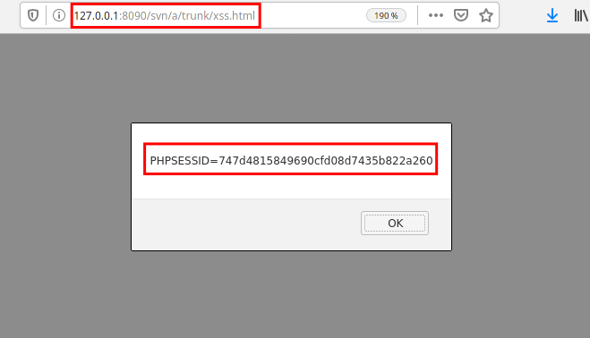
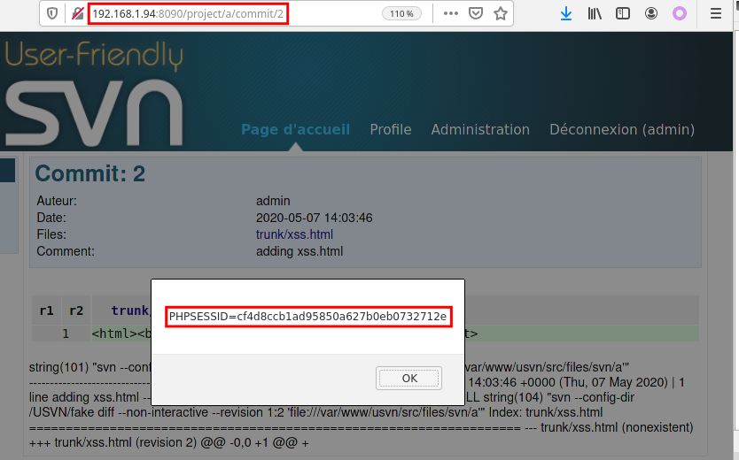

# [CVE-2020-17364] USVN Stored XSS

## Description

User-Friendly USVN is a web interface written in PHP used to configure Subversion repositories.

We found a stored XSS vulnerability inside the commit module that could allow an attacker to execute JavaScript into the application users' webbrowser.

**Threat**

In the case where an attacker have access to a USVN repository, he would be able to remotely inject malicious web page (including JavaScript code) to steal for example user's session cookie.

**Expectation**

User inputs have to be filtered and controlled to verify their type before being used by the application. The content-type in the render f

## Vulnerability records

**CVE ID**: CVE-2020-17364

**Access Vector**: Network

**Security Risk**: Critical

**Vulnerability**: CWE-78

**CVSS Base Score**: 9.9

**CVSS Vector String**: CVSS:3.0/AV:N/AC:L/PR:L/UI:N/S:C/C:H/I:H/A:H

## Details

After getting an SVN project, an attacker could push a malicious web page including JavaScript code into a SVN project:

$ svn checkout http://127.0.0.1:8090/svn/a --username mickael
$ cd a/trunk
$ echo "<html><body>" > xss.html
$ svn add xss.html
$ svn commit -m "adding xss.html"

In the case where a user access the commit from the web application (xss1.png) or directly to the uploaded web page (xss2.png), the JavaScript code will be executed:

Finally, as the session cookie is not protected by the httpOnly flag, an attacker would be able to exploit this stored XSS to steal the authenticated cookie of users. 

## Affected versions

- USVN versions < 1.0.8

## Solution

- Update to USVN >= 1.0.9

## Timeline (dd/mm/yyyy)

* 2020-05-07 Initial discovery.
* 2020-05-13 Report to the USVN security team
* 2020-05-18 USVN acknowledgement stating that the report is under review.
* 2020-05-18 Command injection fix published (http://www.usvn.info/2020/05/20/usvn-1.0.9).
* 2020-08-12 Disclosure.

## Credits

* Mickael KARATEKIN <mickael.karatekin -at- tnpconsultants.com>
